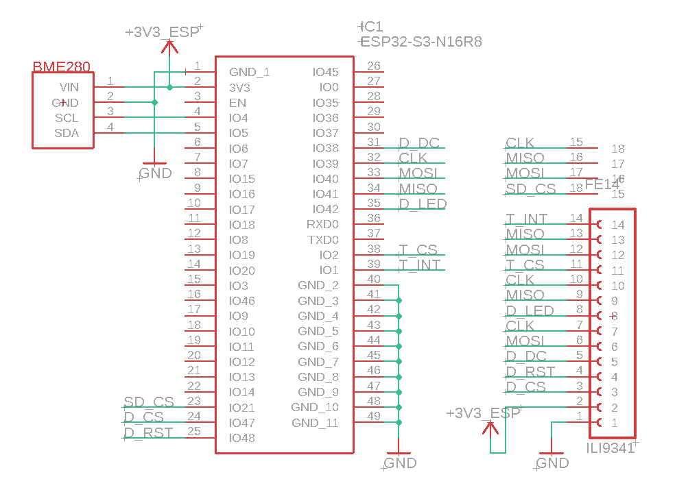

# Weather Station

An ESP32-S3 device that displays weather forecast using the [Open-Meteo API](https://open-meteo.com/), as well as indoor temperature, humidity, and pressure. The device is intended for indoor use.


## Build
```
> idf.py build
```

## Manual
When using the device for the first time, it will start in Access Point mode, displaying the device's IP and sensor data. Connect to the device via Wi-Fi, then open the website at the IP address shown on the display. Once successfully connected to the Wi-Fi network, the device will switch to Station mode and download weather data.


To view the hourly temperature and precipitation probability for a specific day, simply tap the day's widget to display the table.


To access the web interface later, navigate to the IP address shown on the settings screen. To open the settings screen, press and hold the display for 5 seconds.

You can also disconnect the device from Wi-Fi by pressing the disconnect button.

Once on the website, you can view the current sensor data, as well as graphs showing the collected data from the last 24 hours. You can also change the location for the weather forecast; the display will refresh shortly after. The selected location will be saved in the device's memory. 


## Parts
- ESP32-S3 - Microcontroller
- ILI9341 - 320x240 touch display
- BME280 - Temperature, humidity and pressure sensor

## Schematic
